# 简介

> `webim-wechat-miniprogram-demo`属于是相对最近的环信小程序 SDK 集成方式演示项目，此示例供集成微信小程序实现 IM 功能做为参考示例项目，在该项目中通过使用`vant-weapp`加快 UI 逻辑搭建，并使用`mobx`进行部分全局状态管理。

# 运行

> 此项目可以在微信开发者工具中直接导入并点击编译进行项目预览。

# 效果预览

## 登录页面

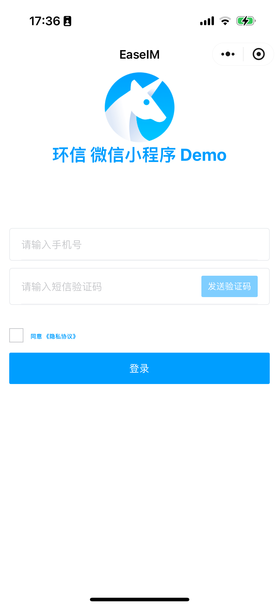

## 会话页

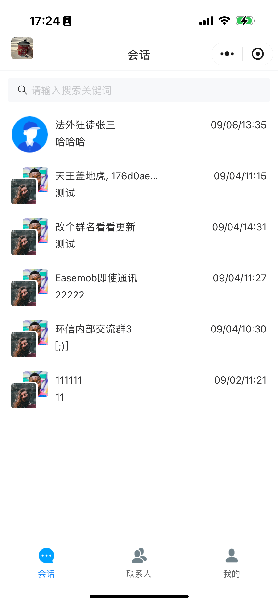

## 联系人

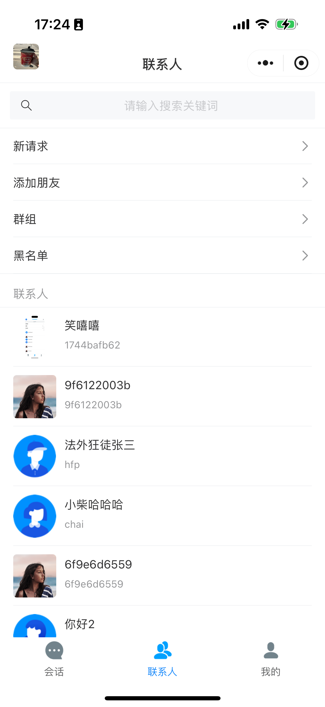

## 我的

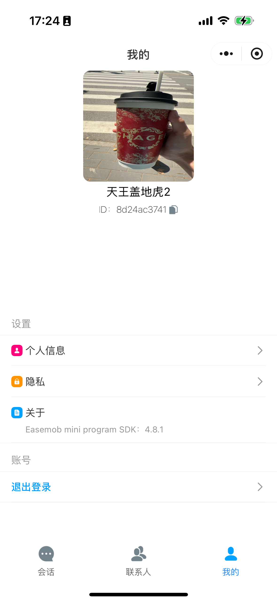

## 群组

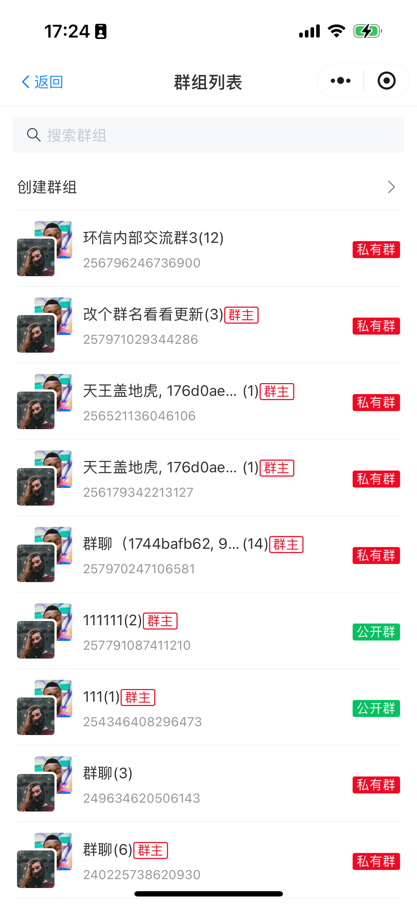

## 群组成员

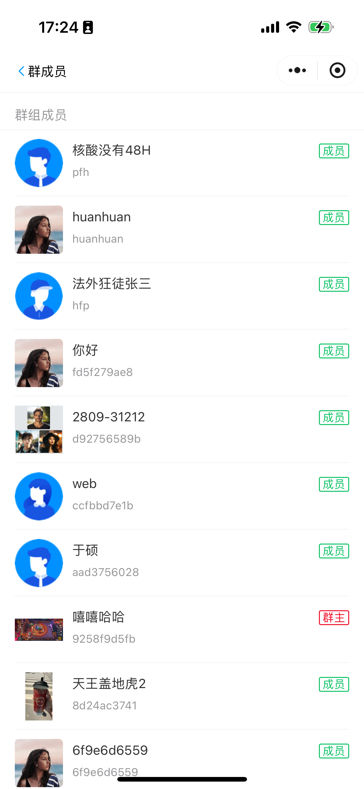

## 群组详情

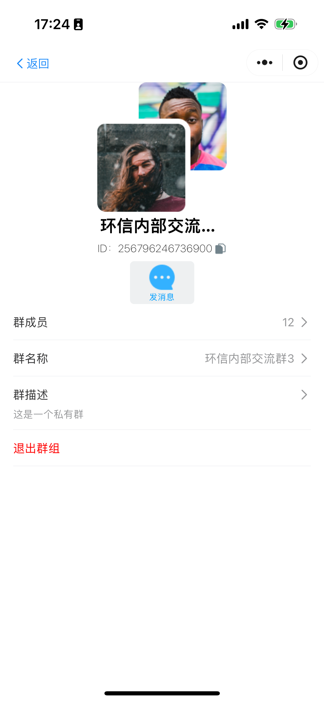

## 聊天页

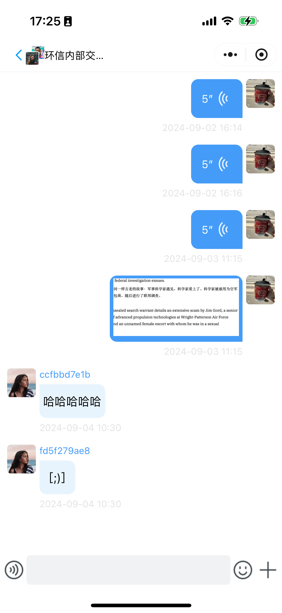

## 发送语音

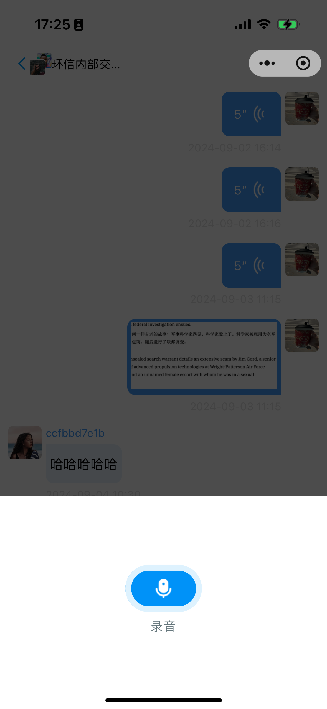

## 发送图片（视频）

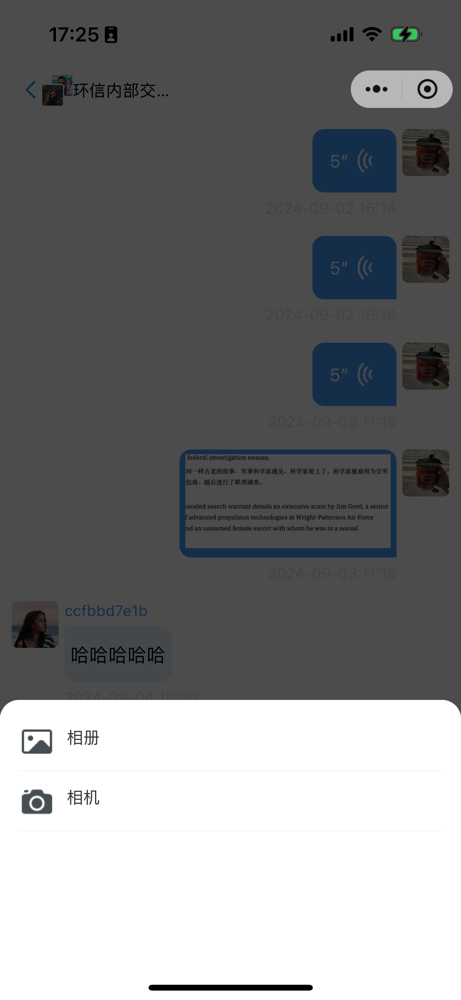

## 发送表情

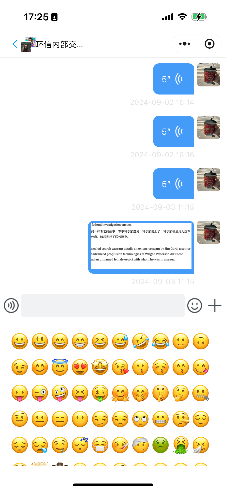

## 长按消息

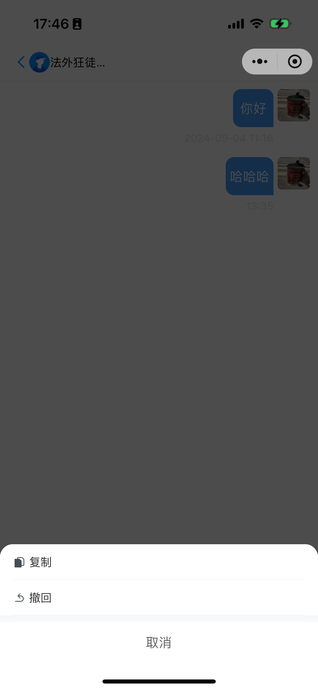

更多功能请下载体验，并会持续更新...

# 扩展内容

## 针对引入 vant-weapp 未使用组件进行 tree-sharing

> 首先需要执行 npm install 并安装 `vant-tree-shaking`在使用`vatn-weapp`集成后，再执行下方命令剔除不适用的 UI 组件。

```shell
npm run vant-t
```

## vant-weapp 的引入

### 安装 vant-weapp 组件

```shell
npm i @vant/weapp -S --production
```
